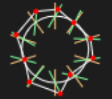

# Small and dynamic Asteroids clone

Arrow left / right to turn 
Arrow up / down to accelerate 
Spacebar to shoot 
Enter to reset 

The asteroids and the spaceship are fully customizable via objects/asteroids.js and objects/spaceship.js respectively 

## Asteroid generation

> Asteroids are generated by first creating a circle with a radius defined by `rad`. 
> Around this circle, `amountPoints` are evenly distributed. 
> From each of these points, a line is drawn towards the center of the circle (illustrated as an orange line) with a length of `vecLength` and an inset of `vecInset`. 
> Each line is then rotated within a range of ±`maxAngle` degrees (for example, a max angle of 45° would allow for a rotation between 45° clockwise and 45° counterclockwise), resulting in the final orientation of each line (shown as the green line). 
> Between the endpoints of these rotated lines, the final points (shown as red points) will be generated, which are connected with line segments to form the irregular shape of the asteroid. 
> For now the collision detection is just based on the circle.  
> These different lines and points can be shown by changing this.display in js/objects/asteroid.js